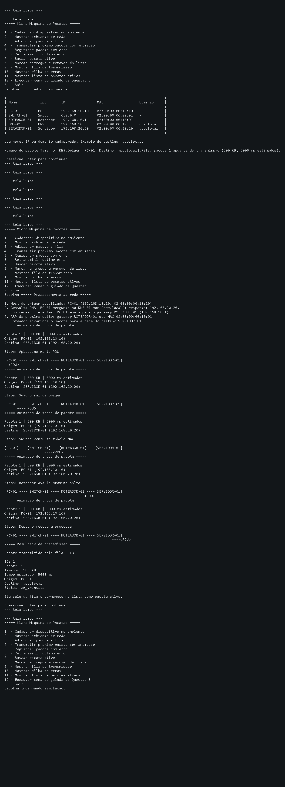

# Sistema de Redes - Simulação de Comutação de Pacotes

Projeto em C para simular uma rede simples de computadores usando estruturas de dados. A implementação atende à Questão 5 da atividade de Estrutura de Dados, com fila, pilha e lista encadeada aplicadas ao fluxo de pacotes.

## Objetivo

Simular, no terminal, uma micro rede baseada na ideia de comutação de pacotes:

```text
PC-01 -> SWITCH-01 -> SERVIDOR-01
```

Na implementação atual, a topologia didática usa também um roteador e um servidor DNS:

```text
PC-01 -> SWITCH-01 -> ROTEADOR-01 -> SERVIDOR-01
                    |
                  DNS-01
```

O programa não cria tráfego real de rede. Ele modela o comportamento dos pacotes em memória para mostrar como cada estrutura de dados resolve uma parte do problema e como a rede localiza um destino por nome, IP e MAC.

## Relação com a Questão 5

O enunciado pede uma simulação com:

- número do pacote;
- tamanho em KB;
- tempo estimado de transmissão;
- fila de pacotes aguardando transmissão;
- pilha de pacotes com erro;
- lista encadeada de pacotes ativos;
- busca, listagem, retransmissão e remoção de pacote entregue.

Pacotes usados no cenário-base:

| Pacote | Tamanho |
| --- | ---: |
| 1 | 500 KB |
| 2 | 300 KB |
| 3 | 700 KB |
| 4 | 200 KB |

## Como compilar

Linux, macOS ou Windows com GCC/MinGW:

```bash
gcc main.c pacote.c ambiente.c interface.c simulador.c fila.c pilha.c lista-encadeada.c -o sistema-redes
```

Windows, gerando `.exe`:

```bash
gcc main.c pacote.c ambiente.c interface.c simulador.c fila.c pilha.c lista-encadeada.c -o sistema-redes.exe
```

TinyCC também funciona para validação local:

```bash
tcc main.c pacote.c ambiente.c interface.c simulador.c fila.c pilha.c lista-encadeada.c -o sistema-redes.exe
```

## Como executar

Linux/macOS:

```bash
./sistema-redes
```

Windows:

```powershell
.\sistema-redes.exe
```

No menu, a opção `12 - Executar cenario guiado da Questao 5` roda a demonstração completa do enunciado.

## Como usar

1. Abra o programa no terminal.
2. Use `2 - Mostrar ambiente de rede` para ver os dispositivos já cadastrados.
3. Use `1 - Cadastrar dispositivo no ambiente` se quiser incluir outro PC, servidor, roteador, switch ou DNS.
4. Use `3 - Adicionar pacote a fila` para informar número, tamanho, origem e destino.
5. Use `4 - Transmitir proximo pacote com animacao` para ver a resolução DNS/ARP e o movimento da PDU.
6. Use `5 - Registrar pacote com erro` e `6 - Retransmitir ultimo erro` para demonstrar a pilha.
7. Use `8 - Marcar entregue e remover da lista` para demonstrar a remoção na lista encadeada.

O destino pode ser informado como nome, IP ou domínio cadastrado. No ambiente padrão, `app.local` resolve para `SERVIDOR-01`.

## Evidências de execução

As imagens abaixo foram geradas a partir da saída real do executável no terminal local. Os transcripts completos também estão em `docs/assets`.

### Cenário guiado da Questão 5


### Animação de PDU com DNS e ARP



### Demonstração da pilha LIFO


## Estrutura do código

| Arquivo | Responsabilidade |
| --- | --- |
| `main.c` | Menu principal e troca de telas. |
| `rede.h` | Structs, enum de status e protótipos. |
| `pacote.c` | Montagem do pacote, status textual e tempo estimado. |
| `ambiente.c` | Cadastro de dispositivos, DNS didático, ARP e decisão de rota. |
| `interface.c` | Limpeza de tela, pausa, leitura e animação ASCII da PDU. |
| `simulador.c` | Ações do menu e cenário guiado. |
| `fila.c` | Fila FIFO de pacotes aguardando transmissão. |
| `pilha.c` | Pilha LIFO de pacotes com erro. |
| `lista-encadeada.c` | Lista de pacotes ativos, busca, status e remoção. |

## Como a micro máquina funciona

1. O usuário cadastra ou usa o ambiente padrão.
2. O pacote entra na fila de transmissão.
3. Antes da transmissão, o destino é resolvido por nome, IP ou domínio.
4. Se o destino for um domínio, o fluxo mostra uma consulta DNS didática.
5. O próximo salto é resolvido por ARP: destino local ou gateway.
6. A animação ASCII mostra a PDU passando pela topologia.
7. Se houver erro, o pacote entra na pilha de retransmissão.
8. Quando um pacote é entregue, ele pode ser removido da lista encadeada.

O tempo estimado é calculado com uma taxa didática de `100 KB/s`. Assim, um pacote de `500 KB` aparece com `5000 ms` estimados. Esse valor não mede rede real; serve para tornar o campo do enunciado visível na simulação.

## Respostas teóricas

### Por que a fila representa bem a transmissão de pacotes?

A fila trabalha com FIFO: o primeiro pacote que entra é o primeiro a sair. No cenário-base, o Pacote 1 chega antes dos outros e por isso é transmitido primeiro. Isso representa uma interface de rede simples em que os pacotes aguardam atendimento em ordem de chegada.

### Por que a pilha pode representar retransmissão?

A pilha trabalha com LIFO: o último pacote registrado com erro fica no topo. Se o Pacote 2 falha e depois o Pacote 4 falha, o Pacote 4 será retransmitido primeiro. Esse modelo é útil para demonstrar prioridade ao evento de erro mais recente.

### Por que a lista encadeada ajuda no controle de pacotes ativos?

A lista encadeada permite manter pacotes ativos sem depender de posições fixas em um vetor. Isso facilita buscar um pacote pelo número, alterar status e remover um pacote entregue sem reorganizar uma estrutura inteira manualmente.

### Qual estrutura melhor representa atraso de fila?

A fila representa melhor o atraso, porque nela é possível observar quantos pacotes ainda estão aguardando antes de um pacote ser transmitido. Quanto mais pacotes à frente, maior o tempo de espera daquele pacote.

## Decisões técnicas

- A interface foi mantida em terminal para facilitar execução em máquinas de laboratório.
- Bibliotecas como PDCurses/ncurses foram avaliadas, mas não entraram como dependência obrigatória para não aumentar o custo de ambiente.
- O programa usa telas limpas, tabelas textuais e animação ASCII para aproximar a experiência de simulação passo a passo, sem tentar reproduzir uma interface gráfica como o Cisco Packet Tracer.
- O aprofundamento de rede usa DNS e ARP em nível didático: o programa mostra o raciocínio de resolução, mas não envia consultas reais.
- O executável `main.exe` existente no repositório foi preservado para evitar misturar limpeza de artefatos com a implementação funcional.

## Limitações

- Não há sockets, roteamento real, TCP/IP real ou tráfego entre máquinas.
- O switch da topologia é conceitual.
- DNS e ARP são simulações locais baseadas no cadastro de ambiente.
- O tempo de transmissão é estimado por fórmula didática.
- O foco do projeto é demonstrar estruturas de dados, não desempenho de rede.

## Documentação complementar

- `docs/prd-questao-5-simulacao-redes.md`: PRD técnico da implementação.
- `docs/workflow-questao-5.md`: fluxo de trabalho seguido no projeto.
- `docs/roteiro-testes.md`: roteiro de validação local.
- `docs/relatorio-implementacao.md`: decisões, problemas encontrados e explicação técnica.

## Referências

- Cisco Packet Tracer Data Sheet: https://www.cisco.com/c/dam/en_us/training-events/netacad/course_catalog/docs/Cisco_PacketTracer_DS.pdf
- Packet Tracer Help - Operating Modes: https://tutorials.ptnetacad.net/help/default/operatingModes.htm
- RFC 826 - Address Resolution Protocol: https://www.rfc-editor.org/rfc/rfc826
- RFC 1035 - Domain Names: https://www.rfc-editor.org/rfc/rfc1035
- PDCurses User Guide: https://pdcurses.org/docs/USERS.html
- PDCurses for Windows console: https://pdcurses.org/wincon/
