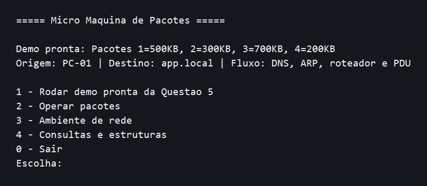
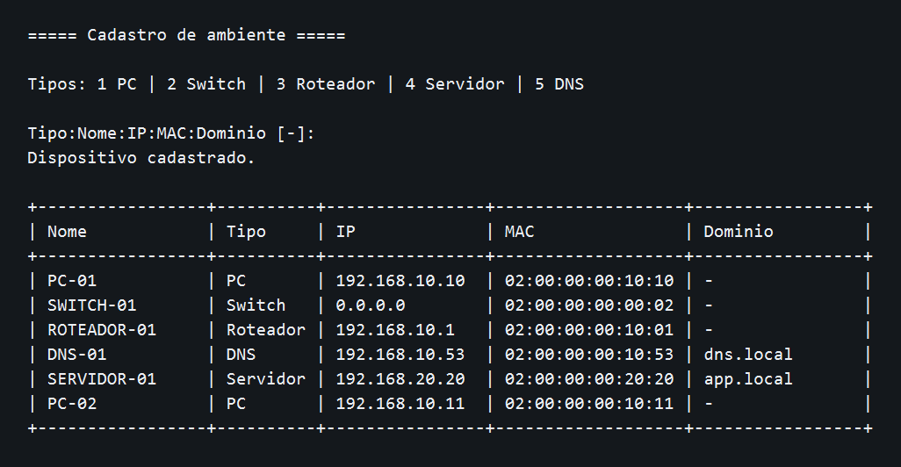
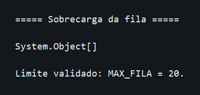
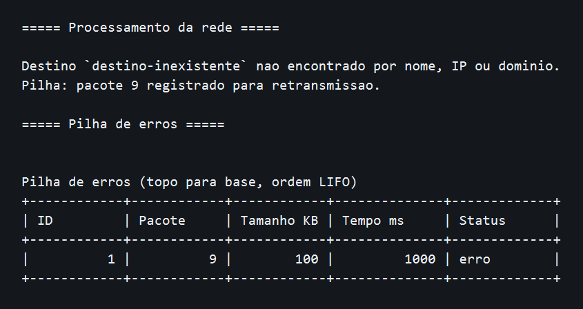
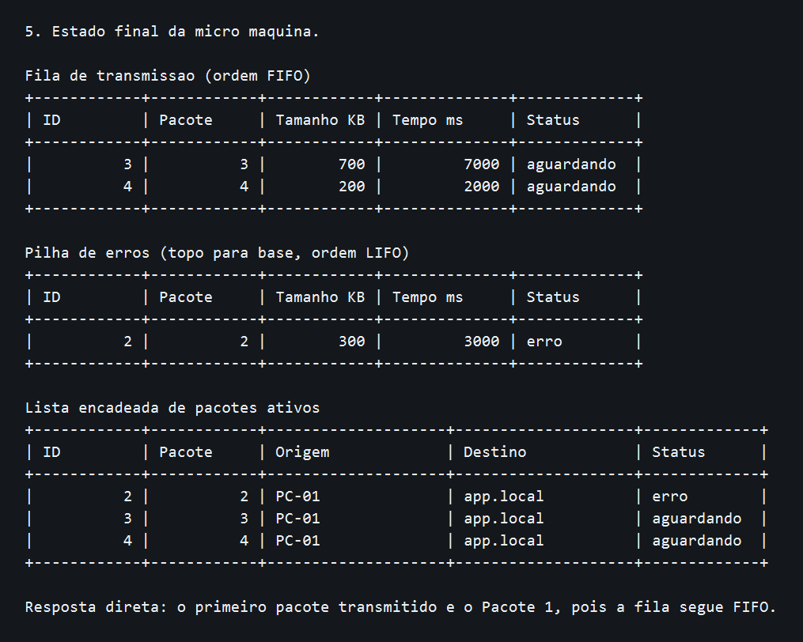
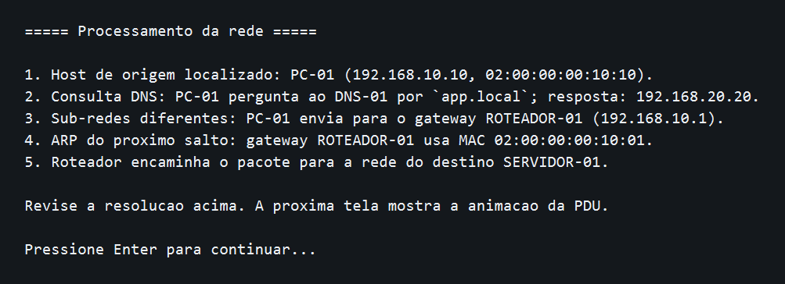
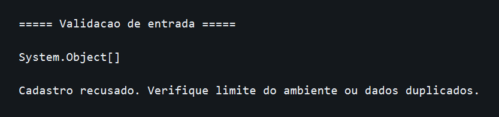
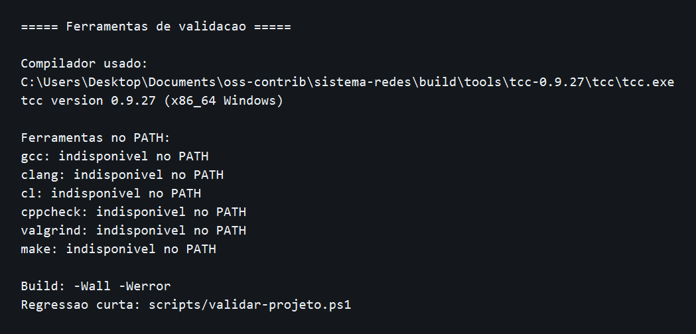
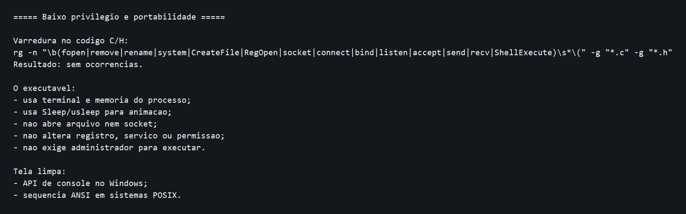

# Sistema de Redes - Simulação de Comutação de Pacotes

Projeto em C para simular uma rede simples de computadores usando estruturas de dados. A implementação atende à Questão 5 da atividade de Estrutura de Dados, com fila, pilha e lista encadeada aplicadas ao fluxo de pacotes.

## Objetivo

Simular, no terminal, uma micro rede baseada na ideia de comutação de pacotes:

```text
PC-01 -> SWITCH-01 -> SERVIDOR-01
```

Na implementação atual, a topologia didática usa também um roteador e um servidor DNS:

```text
PC-01 -> SWITCH-01 -> ROTEADOR-01 -> SERVIDOR-01
                    |
                  DNS-01
```

O programa não cria tráfego real de rede. Ele modela o comportamento dos pacotes em memória para mostrar como cada estrutura de dados resolve uma parte do problema e como a rede localiza um destino por nome, IP e MAC.

## Relação com a Questão 5

O enunciado pede uma simulação com:

- número do pacote;
- tamanho em KB;
- tempo estimado de transmissão;
- fila de pacotes aguardando transmissão;
- pilha de pacotes com erro;
- lista encadeada de pacotes ativos;
- busca, listagem, retransmissão e remoção de pacote entregue.

Pacotes usados no cenário-base:

| Pacote | Tamanho |
| --- | ---: |
| 1 | 500 KB |
| 2 | 300 KB |
| 3 | 700 KB |
| 4 | 200 KB |

## Como compilar

Linux com GCC ou Windows com MinGW/GCC:

```bash
gcc main.c menu.c pacote.c ambiente.c interface.c simulador.c fila.c pilha.c lista-encadeada.c -o sistema-redes
```

macOS com Clang:

```bash
clang main.c menu.c pacote.c ambiente.c interface.c simulador.c fila.c pilha.c lista-encadeada.c -o sistema-redes
```

Windows, gerando `.exe`:

```bash
gcc main.c menu.c pacote.c ambiente.c interface.c simulador.c fila.c pilha.c lista-encadeada.c -o sistema-redes.exe
```

TinyCC também funciona para validação local:

```bash
tcc main.c menu.c pacote.c ambiente.c interface.c simulador.c fila.c pilha.c lista-encadeada.c -o sistema-redes.exe
```

No PowerShell, o script versionado padroniza a compilação e escolhe `gcc`, `clang` ou `tcc` disponível:

```powershell
.\scripts\build.ps1
```

## Portabilidade e privilégio mínimo

O simulador foi projetado para execução local com usuário comum. Ele não exige administrador, não usa rede real, não abre arquivos, não altera registro do Windows, não cria serviço e não depende de banco de dados.

Para rodar, é necessário ter um executável compatível com o sistema operacional. Para compilar, é necessário ter um compilador C ou um compilador portátil, com permissão de escrita apenas na pasta de saída do build.

Detalhes e evidências estão em `docs/portabilidade-baixo-privilegio.md`.

## Como executar

Linux/macOS:

```bash
./sistema-redes
```

Windows:

```powershell
.\sistema-redes.exe
```

No menu, a opção `1 - Rodar demo pronta da Questao 5` roda a demonstração completa do enunciado com os quatro pacotes já carregados.

Para uma apresentação, a demo faz pausas entre as etapas principais. Leia a tela, explique a etapa e pressione Enter para continuar.

## Como usar

1. Abra o programa no terminal.
2. Use `1 - Rodar demo pronta da Questao 5` para ver tudo funcionando sem cadastro manual.
3. Use `3 - Ambiente de rede` e depois `1 - Mostrar ambiente cadastrado` para ver os dispositivos já cadastrados.
4. Use `3 - Ambiente de rede` e depois `2 - Cadastrar dispositivo` se quiser incluir outro PC, servidor, roteador, switch ou DNS.
5. Use `2 - Operar pacotes` e depois `1 - Adicionar pacote manualmente` para informar número, tamanho, origem e destino.
6. Use `2 - Operar pacotes` e depois `2 - Transmitir proximo pacote com animacao` para ver a resolução DNS/ARP e o movimento da PDU.
7. Use `2 - Operar pacotes` e depois `3 - Registrar pacote com erro` ou `4 - Retransmitir ultimo erro` para demonstrar a pilha.
8. Use `4 - Consultas e estruturas` para buscar pacote ativo, fila, pilha e lista sem poluir o menu principal.

O destino pode ser informado como nome, IP ou domínio cadastrado. No ambiente padrão, `app.local` resolve para `SERVIDOR-01`.

## Capacidade da simulação

| Área | Limite atual |
| --- | ---: |
| Fila de transmissão | 20 pacotes |
| Pilha de erros | 20 pacotes |
| Ambiente de rede | 12 dispositivos |

O ambiente padrão já usa 5 dispositivos, então ainda é possível cadastrar mais 7 antes de atingir o limite. Quando a fila, a pilha ou o ambiente atingem o limite, o próximo item é recusado com mensagem no terminal.

## Evidências de execução

As imagens abaixo foram geradas a partir de saídas locais do executável, com recortes menores para facilitar leitura em apresentação.

### Menu principal agrupado



### Cadastro de ambiente



### Sobrecarga da fila



### Erro de destino



### Estado final da Questão 5



### Demo pausada para apresentação



### Validação de entrada



### Ferramentas de validação



### Baixo privilégio



Os transcripts completos e imagens de execução mais longas também estão em `docs/assets`.

## Estrutura do código

| Arquivo | Responsabilidade |
| --- | --- |
| `main.c` | Bootstrap da aplicação. |
| `menu.c` | Rotas principais, submenus e navegação. |
| `rede.h` | Structs, enum de status e protótipos. |
| `pacote.c` | Montagem do pacote, status textual e tempo estimado. |
| `ambiente.c` | Cadastro de dispositivos, DNS didático, ARP e decisão de rota. |
| `interface.c` | Limpeza de tela, pausa, leitura e animação ASCII da PDU. |
| `simulador.c` | Ações do menu e cenário guiado. |
| `fila.c` | Fila FIFO de pacotes aguardando transmissão. |
| `pilha.c` | Pilha LIFO de pacotes com erro. |
| `lista-encadeada.c` | Lista de pacotes ativos, busca, status e remoção. |

## Como a micro máquina funciona

1. O usuário cadastra ou usa o ambiente padrão.
2. O pacote entra na fila de transmissão.
3. Antes da transmissão, o destino é resolvido por nome, IP ou domínio.
4. Se o destino for um domínio, o fluxo mostra uma consulta DNS didática.
5. O próximo salto é resolvido por ARP: destino local ou gateway.
6. A animação ASCII mostra a PDU passando pela topologia.
7. Se houver erro, o pacote entra na pilha de retransmissão.
8. Quando um pacote é entregue, ele pode ser removido da lista encadeada.

O tempo estimado é calculado com uma taxa didática de `100 KB/s`. Assim, um pacote de `500 KB` aparece com `5000 ms` estimados. Esse valor não mede rede real; serve para tornar o campo do enunciado visível na simulação.

## Onde isso aparece no dia a dia

O mesmo raciocínio aparece quando alguém abre um site, usa Wi-Fi, acessa sistema acadêmico, faz pagamento online, imprime em rede ou participa de uma chamada de vídeo. A documentação `docs/aplicacoes-dia-a-dia.md` explica esses casos em linguagem prática, relacionando cada situação com DNS, ARP, roteador, fila, pilha e lista de pacotes ativos.

## Respostas teóricas

### Por que a fila representa bem a transmissão de pacotes?

A fila trabalha com FIFO: o primeiro pacote que entra é o primeiro a sair. No cenário-base, o Pacote 1 chega antes dos outros e por isso é transmitido primeiro. Isso representa uma interface de rede simples em que os pacotes aguardam atendimento em ordem de chegada.

### Por que a pilha pode representar retransmissão?

A pilha trabalha com LIFO: o último pacote registrado com erro fica no topo. Se o Pacote 2 falha e depois o Pacote 4 falha, o Pacote 4 será retransmitido primeiro. Esse modelo é útil para demonstrar prioridade ao evento de erro mais recente.

### Por que a lista encadeada ajuda no controle de pacotes ativos?

A lista encadeada permite manter pacotes ativos sem depender de posições fixas em um vetor. Isso facilita buscar um pacote pelo número, alterar status e remover um pacote entregue sem reorganizar uma estrutura inteira manualmente.

### Qual estrutura melhor representa atraso de fila?

A fila representa melhor o atraso, porque nela é possível observar quantos pacotes ainda estão aguardando antes de um pacote ser transmitido. Quanto mais pacotes à frente, maior o tempo de espera daquele pacote.

## Decisões técnicas

- A interface foi mantida em terminal para facilitar execução em máquinas de laboratório.
- Bibliotecas como PDCurses/ncurses foram avaliadas, mas não entraram como dependência obrigatória para não aumentar o custo de ambiente.
- O programa usa telas limpas, tabelas textuais e animação ASCII para aproximar a experiência de simulação passo a passo, sem tentar reproduzir uma interface gráfica como o Cisco Packet Tracer.
- O aprofundamento de rede usa DNS e ARP em nível didático: o programa mostra o raciocínio de resolução, mas não envia consultas reais.
- A limpeza de tela usa API de console no Windows e sequência ANSI em sistemas POSIX, sem chamar comando de shell.
- O cadastro rejeita pacote inválido, pacote duplicado e dispositivo duplicado antes de alterar o estado da simulação.
- O executável antigo `main.exe` foi removido do versionamento porque não representa mais o código-fonte atual.

## Limitações

- Não há sockets, roteamento real, TCP/IP real ou tráfego entre máquinas.
- O switch da topologia é conceitual.
- DNS e ARP são simulações locais baseadas no cadastro de ambiente.
- O tempo de transmissão é estimado por fórmula didática.
- O foco do projeto é demonstrar estruturas de dados, não desempenho de rede.

## Documentação complementar

- `docs/prd-questao-5-simulacao-redes.md`: PRD técnico da implementação.
- `docs/guia-basico-execucao.md`: guia passo a passo para pessoa não técnica rodar o projeto.
- `docs/workflow-questao-5.md`: fluxo de trabalho seguido no projeto.
- `docs/roteiro-testes.md`: roteiro de validação local.
- `docs/relatorio-implementacao.md`: decisões, problemas encontrados e explicação técnica.
- `docs/aplicacoes-dia-a-dia.md`: exemplos práticos para apresentação.
- `docs/raio-x-qualidade-projeto.md`: arquitetura, decisões, testes, evidências, complexidade e lacunas restantes.
- `docs/portabilidade-baixo-privilegio.md`: execução em máquina comum, permissões necessárias e limites de portabilidade.
- `docs/glossario-tecnico.md`: termos técnicos usados no código, na rede, no build e na documentação.
- `docs/auditoria-pre-pr.md`: parecer técnico antes da abertura do PR.

## Validação local

No PowerShell, a bateria curta reproduzível compila com avisos tratados como erro e percorre os fluxos críticos:

```powershell
.\scripts\validar-projeto.ps1
```

O roteiro manual completo continua em `docs/roteiro-testes.md`.

## Referências

- Cisco/NetAcad - Explore Network Functionality Using PDUs: https://contenthub.netacad.com/legacy/I2PT/1.1/en/course/files/3.1.1.3%20Packet%20Tracer%20-%20Explore%20Network%20Functionality%20Using%20PDUs.pdf
- Cisco/NetAcad - Learn to Use Packet Tracer: https://contenthub.netacad.com/legacy/NetEss/1.0/en/course/files/3.5.2.4%20Packet%20Tracer%20-%20Learn%20to%20Use%20Packet%20Tracer.pdf
- RFC 826 - Address Resolution Protocol: https://www.rfc-editor.org/rfc/rfc826
- RFC 1035 - Domain Names: https://www.rfc-editor.org/rfc/rfc1035
- SEI CERT C Coding Standard: https://wiki.sei.cmu.edu/confluence/display/c
- GCC Warning Options: https://gcc.gnu.org/onlinedocs/gcc-15.1.0/gcc/Warning-Options.html
- Cppcheck Manual: https://cppcheck.sourceforge.io/manual.html
- Valgrind Memcheck Manual: https://valgrind.org/docs/manual/mc-manual.html
- Diátaxis documentation framework: https://diataxis.fr/
- PDCurses User Guide: https://pdcurses.org/docs/USERS.html
- PDCurses for Windows console: https://pdcurses.org/wincon/
